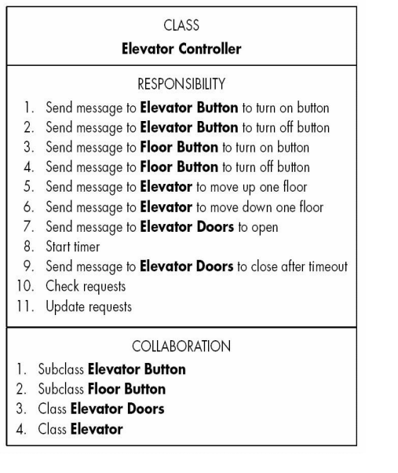
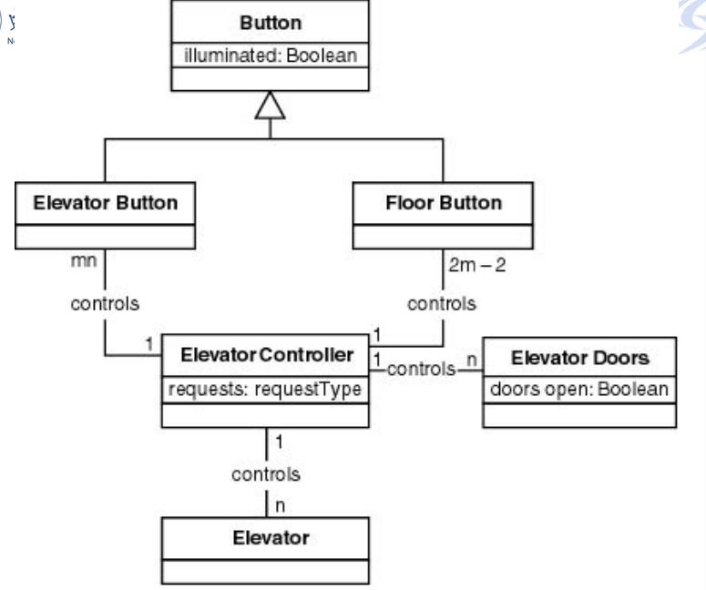

CRC Cards（CRC卡片）

CRC卡片方法，Class-Responsibility-Collaboration（类-职责-协作）

CRC卡片就是指对每一个类都贴一张卡片，

- 类名
- 功能（职责）
- 类将激活的其他的类（协作）

缺点

- 需要较多的领域知识

优点

- 明确的显示出缺少的或不正确的事项
- 非常适合用来做测试

用CRC对面向对象分析结果进行测试

电梯例子

发现点亮电梯按钮不符合面向对象范型，点亮电梯按钮是电梯自己的职责而不是电梯控制器的职责，也就是说，如何点亮电梯按钮应该在电梯内部来实现，正确描述应该是这样的，向电梯按钮发送消息让它点亮自己。

进一步分析发现有一个类被漏掉了，电梯门被漏掉了，电梯门会发生状态的转变，门开或门关，需要进行改进。

改进后的类图是这样子

