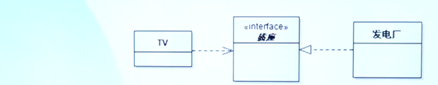

# 1、面向对象思想的起源

艾伦·凯
-------
- Smalltalk语言之父
- 创造性地提出面向对象编程思想
- 提出Dynabook的概念
- 2003年获得图灵奖

计算机界的一位天才级人物 Alan.Kay
----
> 所有对事物的认识都始自于我们不愿盲目地接受这个世界 --艾伦.C.凯

生平：家庭的熏陶
------
1940年，艾伦·凯出生在美国的马萨诸塞州

> 我的父亲是科学家，母亲是艺术家，所以在我童年的家庭氛围中充满了各式各样的想法，以及各种各样表达它们的方式。我至今也从未把“艺术”和“科学”分开过。---艾伦·凯

凯3岁的时候学会了越读，小小的经常乘醉在书的海洋里。同时他从母亲那儿接受了音乐的熏陶，不仅是学校合唱团的男中音独唱，还会演奏吉他。那时的他觉得自己未来肯定会成为一位音乐家。

生平：善于观察与思考
-------

后来，他进入美国空军服役，遇到了一个改变命运的契机：通过了计算机编程能力测试，成为了一名程序员，为空军解决各个航空训练设备之间数据和过程（procedure）的传输问题。

这时他发现有个程序员想出了一个聪明的办法，就是把**数据**和**处理数据**的过程捆绑到一起发送。

亮点：通过这种方式，新设备里的程序就可以直接使用过程，而不用去了解数据文件的格式。

这种抛开数据、直接操作过程的想法给带来了极大的触动，为他日后形成**“对象”**的概念埋下了伏笔。

生平：善于联想、类比
-------
服役结束后，凯先从卡罗拉多大学取得数学和分子生物学的双学位。后来因为对计算很感兴趣，他最终决定去犹他州立大学读计算机科学系。读书期间，他一直在寻找某种**基础构件**，支持一种简单、有效的编程风格。这时他的**生物学知识**给了他至关重要的灵感。

亮点：勤于思考、知识点融合、类比、产生新的思想

> 我的灵感就是把这些（指对象）看作生物学上的细胞。——艾伦·凯

1) 每个**“例”**细胞都遵从**“主”**细胞的某种基本行为
2) 每个细胞都能独立运作，它们之间由能透过细胞膜的化学信号进行通信。
3) 细胞会分化——根据环境不同，同一个细胞可以变成鼻子的细胞，也可以变成眼睛或者叫支架的细胞

这已经是提出**面向对象思想**的黎明时分了！

生平：面向对象思想的推出
-------
> 预测未来的最好办法，就是把他创造出来。——艾伦·凯

1971年夏天，艾伦·凯负责设计一种新的语言，名字叫做Smalltalk。
Smalltalk的设计确实与生物学上的类比较吻合：
- 相互独立的个体（细胞）通过发送讯息彼此交流。
- 每一条讯息都包含了数据、发送者地址、接收者地址，以及有关接收者如何对数据实时操作的指令。

凯希望把这种简单的讯息机制贯彻到整个语言中去，这些想法组成了“面向对象”的核心内容。

面向对象在20世纪90年代变成了软件设计的基本方法与技术！它更贴近人类思维的特点。

艾伦·凯（Alan Kay）的思考
-------
- **“预测未来的最佳方式就是去创造它”**
- **“愿景重于目标”**
- “我把对象想象成生物细胞或者和网络上的单个计算机，它们之间只能通过消息进行通讯”--作为微生物学家背景
- 每个对象可以有多个代数与之关联，这些代数关系可以构成家族，而这些概念会非常有用--作为数据学背景
- 他提倡应该关**消息机制**和**模块间的松耦合和交互**，而不是模块内部的对象组成：
    - 做出非凡和可成长的系统的重中之重是设计好模块之间如何通讯，而不是模块应具有什么样的内部属性和行为方法

# 2、面向对象的基本概念

- ### 类 Class
- ### 对象 Object

**注：台湾学者把Object翻译成“物件”**

类与对象
----
- 类与对象，这两者之间的关系

    - 有点像“先有鸡”还是先有蛋“的关系一样，有一点”绕“
    - 从他们的定义就可以看出来：
        - 用对象来定义类、用类来产生对象！
    - 我们在学习本课程的时候，可以忽略这个问题
        - 有的时候在表达概念的时候，对象与类可以通用！
    - 在设计软件系统的时候，对象是不存在的。
    - 软件系统运行时，在内存中创建对象。类不存在于物理世界

1、什么是类、对象
----------
- 共享相同属性、操作、方法、关系或者行为的一组对象的描述符

- 一个对象时根据一个类创建的一个实例
    - 类，定义了实例的行为和信息结构
    - 对象的当前状态（实力变量的取值）取决于作用于该对象的操作

2、练习：类和对象
----------
比喻：
做蛋糕的模板---（）；一块块蛋糕---（）
电视机原理图---（）；一台台电视机---（）

3、类的构成、对象的构成
------

- ### 注意：概念之间的互用

    - 属性Attribute == 数据Data == 状态state == 信息information
    - 操作operation == 方法Method == 行为behaviour == 职责responsiibility
    - 对象object ==  实例instance

4、软件功能是如何完成的？
------

- ### 类
    - 定义了对象群体的逻辑结构，包括属性和操作
    - 系统运行时，类作为产生对象的模板，在物理层面是不存在的
- ### 对象
    - 系统运行时必须为每一个需要的对象分配内存、保存数据
    - 对象存在于物理层面，每个对象都有自己的数据空间（内存）
    - 所有的对象共享同一块空间
- ### 消息
    - 对象之间的一种交流手段
      
        - 就像我们日常工作中的各种交流手段
- ### 所有相关对象之间相互协作完成软件功能

5、类和对象小结
----
- 每一样东西都是对象
- 一个程序就是一大群对象，通过消息要求对方做点事情
- 每个对象都有自己的内存空间，里面放了许多其他的对象
- 每个对象都有一个类型
    - 每个对象都是一个类的实例，此处，”类“就是”类型“
- 某一类型的所有对象都能接受相同的消息

# 3、什么是面向对象的思考方式

思维方式很重要
----
- 软件工程师与人打交道的、是为人提供服务的
    - 问题是什么？
    - 谁碰到了问题？
    - 问题的本质是什么？
    - 问题该如何解决？

对于想成为问题解决者的人来说，入门的关键是”把单一的思维模式切换成多重思维模式

> - 一本《红楼梦》，经学家看见《易》，道学家看见淫才子看见缠绵，革命家看见排满，流言家看见宫闱秘事。——鲁迅
> - 横看成岭侧成峰，远近高低各不同。——苏轼

什么是面向对象的思考方式？
------------

- 定义
    - 在世界/系统进行观察/建模的时候，把他们看成是由一系列相互交流、互为影响的对象集（a set of objects）

    有两个含义：
    - 一，世界是由相互的对象组成的
    - 二，描述与构建由对象组成的系统

- ### 软件开发常规的两种思维方式：面向对象和面向过程

    - OO strategy（OO策略） 适合处理不确定的事件、创新性的事件
    - Structured Strategy（结构化策略） 处理已知的事实、重要的条件都已知的场景

- 例子1， 如何设计和规划一个项目
    - STRU：骨架框架→结构要素
    - OO：最终结构没有固定的平面图，而是自成一体的小部分。
- 例子2，一个历史学家和一个创作型小说家的两种写作策略。
- 例子3，流水生产线与一场篮球赛

面向对象的思考方式
----

- ### C语言是一种面向过程的思维方式
  
    - 程序的运行“一切尽在掌握中”：从main（）函数的逐条语句开始执行、调用了子程序就必须一层层返回，最后又返回main函数
- 系统需要完成的功能，分配到哥哥子函数，由main函数统一调度
  
- ### 比较
    - 面向过程侧重于思考方法的编写（那个方法做什么，不考虑所涉及的数据在哪里）
    - 面向对象则致力于将数据和方法做一个封装（分配一个对象做事，要考虑所需要的数据是否和它在一起

主要概念
---
- ### 包括
    - 面向对象分析OO analysis
    - 面向对象设计OO design
    - 设计模式 design patterns
    - 统一建模语言 the Unified Modeling Language（UML）
    - 面向对象编程 OO Programming
        - 各种OO编程语言
            - C++/java/C#/.NET etc
            - 以及其他许多与OO编程相关的话题  
- ### 最重要的是
    - 以面向对象的思维方式去思考要解决的问题

面向对象的核心特征
---------

- ### 以下是基础概念
- 对象/类
- 方法/消息
- 封装
- 继承
- 接口/实现
- 多态
- 组合/聚合
- 抽象

- ### 高级面向对象概念
- 面向对象原则
- 设计模式

# 4、面向对象的核心特征（一）

封装 Encapsulation
继承 Inheritance
多态 Polymorphism

1）封装 Encapsulation
-----
- ### Encapsulation
    - 隐藏了对象的实现细节
    - 内部的状态不为其他对象所访问
    - 对象的数据只能通过接口进行访问
- 封装是的对象可以被看成一个“黑盒子”
- 保护数据
- 一个对象实现方法的改变，不影响其他相关对象
- 对象间通过“接口”进行通信

- ### 要封装什么？
    - 内部的、不想让其他人了解的信息
    - 可以封装类的属性，如“人”这个类，封装个人的工资、资产、年龄等信息
    - 可以封装类的方法，如”人“如何赚钱（）？如何消磨时间（）？
- ### 我们为什么要封装
    - 保护隐私
    - 保护数据安全
    - 隔离复杂度（内部实现细节不对外公开）。如”空调“封装了制冷的过程，对人提供了一个制冷的按钮
- ### 面向对象的封装有四种方式（可见性）
    - Public
    - Private
    - Protected
    - Pakcage

- ### 规则：

    - 一个对象应该只揭示与它交互所需的接口。与对象的使用无关的细节应该被其他对象所隐藏。
    - 这是封装的一般规则。
- ### 建议：

    - getters和setters
        - 支持数据隐藏的概念。
        - 因为其他对象不应该直接操作另一个对象中的数据。

- ### 例如，

    - 如果用户对一个属性进行访问，
        - 则调用一个方法来返回该属性(getter)。

2）继承 Inheritance
----
- ### 基本原理很简单：

- 一个类得到另一个类的状态和行为，并添加额外的状态和行为。

- 

3）多态 Polymorphism
------
- ### 本意：有多种形态：Having many forms”
    - 当一个类从另一个类继承而来，多态使得子类可以代替父类
    - 消息发送方不需要知道消息接收方属于哪个子类
    - 同一类族的接口这可以按自己的方式处理消息

- ### 推论 Consequence
    - 同一类族的接收者可以按照自己的方式处理同一个消息
    - 有多种对象可以按自己的方式处理相同的数据
    - 

# 5、面向对象的核心特征（二）

- ### 聚合/组合 Aggregation/Composition
- ### 接口/实现 Interface/ Implementation
- ### 抽象 Abstraction

1) 聚合/组合 Aggregation/Composition
-----
继承是指一个类继承另一个类的特性。

这也就是所谓的是一种“is a”关系。

a car is a vehicle 一辆汽车是一个车辆
a student is a person 学生是一个人

聚合描述了一种 "has a"的关系。一个对象是另一个对象的一部分 
a car has wheel 一辆汽车有轮子
a person has legs 一个人有腿

- ### 聚合表示
  
    - 一个对象包含一个其他对象的集合。
- 如：大学是由学生、老师组成的。
  
- ### 聚合关系是传递的
    - 如果A包含B，B包含，那么A包含C。

    - 聚合关系不对称

        - 如果A包含B，则B不包含A。

- ### 聚合关系的一个变种，成为组合，组合强调：整体控制这部分的生命
    - 部分对象只能存在于整体对象之中，整体对象控制着部分对象的生命周期
    - 如果A组成B，A被删除了，那么B也被删除了
    - 如：手掌与手指

- ### 有些时候，聚合与组合的关系不是很明确
    - 例如：房子与门

2) 接口/实现 Interface/Implementation
----
- ### 生活中的例子，比比皆是
    - 电视机接口、水管接口等，举例：汽车里面有哪些接口？方向盘就是一个接口

- ### 对于软件系统
    - 软件系统的内部是有大量的互相关联的类构成的
    - 当对其中一个类的局部进行修改的时候，不能影响其他的类

- ### 接口 interface
    - 描述一个类的用户如何与这个类交互

- ### 实现 Implementation

    - 完成了接口所定义的功能，如类、构件等完成的任务

- ### 例如
    - TV、电源插座、发电厂之间的关系？

-  TV是顾客、用户
-  插座是接口
-  发电厂是实现

3） 抽象 Abstraction
----

- ### 抽象是一种思维方式，一种思维能力

    - 抽取比较像的部分出来
        - 练习：人、狗、猫，你能抽象出什么？哺乳动物

    - 继承的强大就在于它的抽象和组织技术
- 客观世界的食物有各种各样的实体（对象）构成
- 每个对象都有各自的内部状态和运动（状态）规律
- 根据对象的属性和运动规律的相似性可以将对象分类
- 毛主席提出的“统一战线”，“论持久战”都是高度抽象的结果
- 抽象错了，危害很大！
  
    - 如张国焘的南下抗日！

- ### 定义：
    - 抽象表示了一个对象与所有其他对象相区别的基本特征，因此提供了同观察者角度有关的清晰定义- 的概念界限

    - 着重于最重要的方面而忽略不重要的细节的过程。
    
    - 通过专注于使一个实体与其他实体不同的基本方面，使我们能够管理复杂性。
    - 订单处理抽象的一个例子

- ### 简单地讲
    - 抽象就是过滤掉对象的一部分特性和操作，直到只剩下你所需要的属性和操作- 

- ### 抽象与具体的比较

- 你要到飞机场去，坐进出租车，该如何描述？

    - A：师傅请送我去飞机场！
    - B：师傅，走！出门左拐、直行、过桥、右转、直行、红绿灯左拐继续直行....

- 你觉得哪个是抽象？你喜欢用哪种方式？
- 抽象是面向对象领域发现类的主要方法

