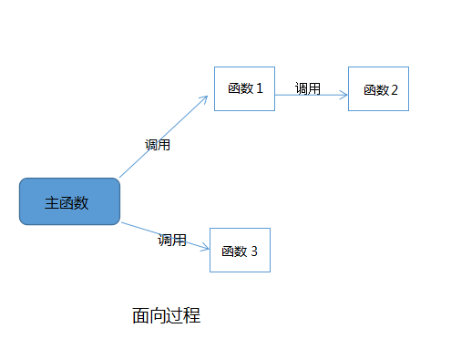

# 面向过程(Procedure Oriented)

**定义**：面向过程(Procedure Oriented)是一种思想，是人们考虑解决问题的方法，它是将一个问题拆分成多个小问题，直至一个小问题可以直接解决为止。


# 面向过程编程

**定义**：面向过程编程是将面向过程的思想应用到编程领域，是一种以过程为中心的编程思想，就是分析出解决问题所需要的步骤，然后用函数把这些步骤一步一步实现，使用的时候一个一个依次调用就可以了。



## 举个例子：**把大象装冰箱**

### 用python来实现

```python
# 大象有身高，体重等属性
elephant= {
    'height':'2m',
    'weight':'3000kg'
}

# 冰箱有长宽高等规格属性
fridge={
    'lenght':'0.5m',
    'width':'0.6m',
    'height':'1.9m'
}

# 打开冰箱
def openTheFridge():
    pass
# 把大象放进冰
def putTheElephantInTheFridge():
    pass
# 关闭冰箱门
def closeTheFridgeDoor():
    pass

def main():
    openTheFridge()
    putTheElephantInTheFridge()
    closeTheFridgeDoor()
```

### 用JavaScript来实现

```javascript
//大象有身高，体重等属性
elephantHeight = "2m";
elephantWeight = "3000kg";

//冰箱有长宽高等规格属性
fridgeLenght = "0.5m";
fridgeWidth = "0.6m";
FridgeHeight = "1.9m";

// 打开冰箱
function openTheFridge() {}
// 把大象放进冰箱
function putTheElephantInTheFridge() {}
// 关闭冰箱门
function closeTheFridgeDoor() {}

function main() {
    openTheFridge();
    putTheElephantInTheFridge();
    closeTheFridgeDoor();
}

```


**优点**：性能比面向对象高，因为类调用时需要实例化，开销比较大，比较消耗资源;比如单片机、嵌入式开发、 Linux/Unix等一般采用面向过程开发，性能是最重要的因素。

**缺点**：没有面向对象易维护、易复用、易扩展。