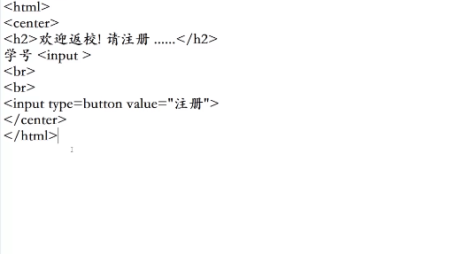
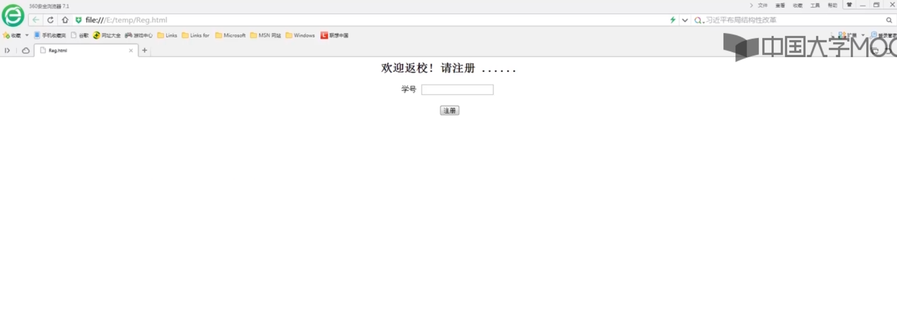
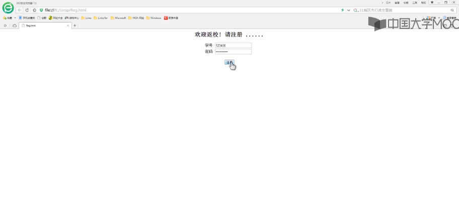
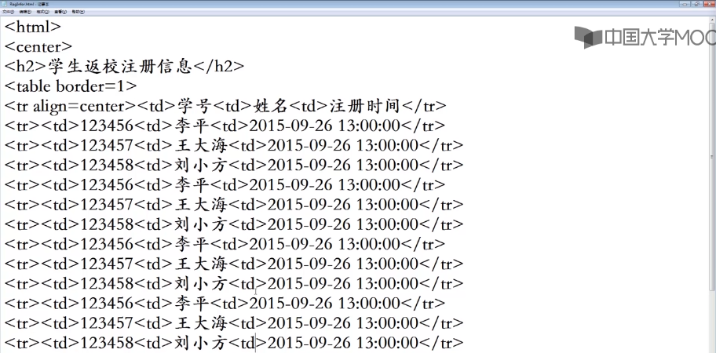
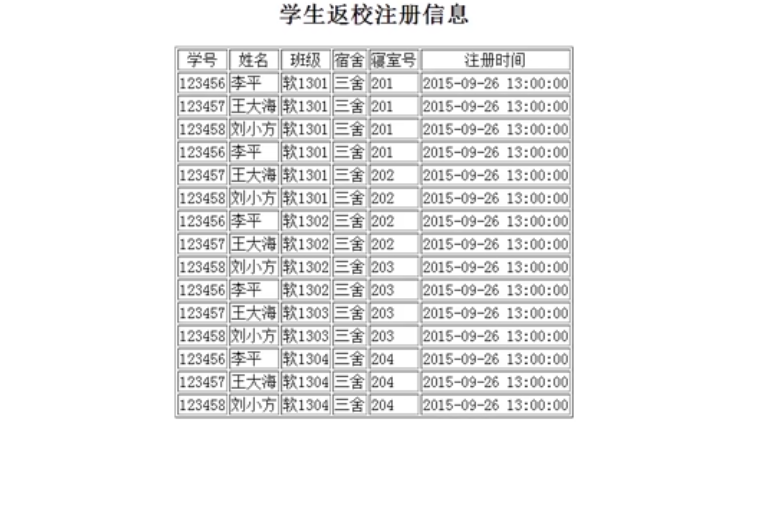
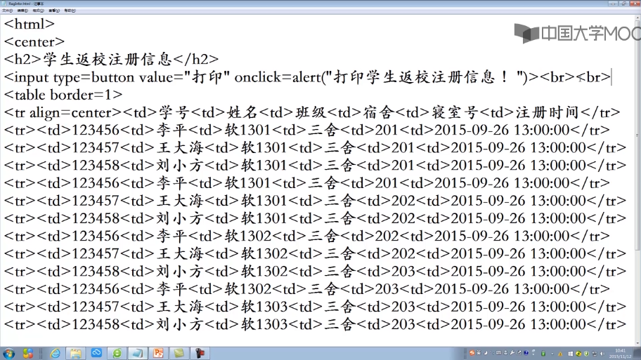
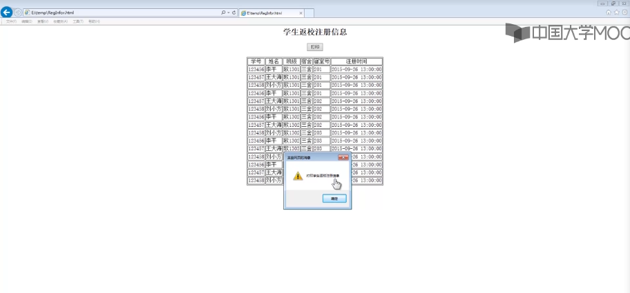

快速原型是一种非常有效的获取需求的手段，是一种能够帮助客户方，用户方和开发方快速准确的获取业务需求的一种方法和手段

目标软件系统的一个模型

它不是真正的实现了软件系统，它只要能够反映一些关键的功能，界面以及必要的一些交互即可，其目的就是要在目标软件系统设计和开发之前，让客户和用户能够看得到，能够提前见到软件系统并且与之进行交互，从而启发和引导客户对目标软件系统的全面的深入的思考，那么采用什么语言来搭建快速原型呢？

事实上，只要选择的语言只要能够保证快速的搭建出原型即可，接下来用一个案例来演示，如何利用快速原型来高效的，准确的获取和确定客户的需求。 我们所采用的例子是同学们学习和生活中比较熟悉的学生管理系统中的新学期学生返校注册系统，使用html语言来搭建快速原型。

新学期学生返校注册系统是由学生办来负责的工作
现在假设我就是目标软件系统需求的调研人员，而新学期学生返校注册系统是由学生办来负责，所以我要与学生办的辅导员老师进行需求的调研和确认。

我要利用快速原型来进行这项工作，在与学生办的辅导员老师会谈之前，我先利用html语言搭建一个快速原型。

现在大家在浏览器看到的这个页面，就是学生注册这个功能的快速原型，现在我与辅导员老师进行注册功能的需求调研和确认，我想辅导员老师介绍说看，我们有了这个目标软件系统之后，学生返校回到学校，就可以登录我们这个系统中，然后输入自己的学生证号 ，点击注册按钮，就可以完成返校注册。

辅导员老师看到这个原型和演示之后，就会提出建议说，只有学生证号是不足够的，为了避免同学之间替代注册，是不是可以增加密码，这个需求当然合理，所以我们完全可以现场就修改这个模型。

至此，辅导员老师对注册的功能表示认可，同时受到注册的这个原型的启发，辅导员老师又想到了更多的需求，他说，她希望她能够随时掌握学生注册的情况，想知道哪些同学什么时候进行了注册，事实上，辅导员提出的这个需求，就是想要一个查询注册信息的功能，我们同样可以在现场很快的搭建出这个新需求的快速原型，我们可以用一到两分钟时间做出了一个html文件，

来展示学生返校注册信息查询的这个功能，很自然的，辅导员老师对这块业务的需求被我们的快速原型调动起来了，辅导员老师即刻就会指出更多的需求，辅导员老师即刻就会指出我们这个原型所表达的信息不够全面，只有学号，姓名和注册时间还不足够，能不能再提供更多的信息，包括学生的班级，所在的寝室等等。

辅导员老师提出的这个需求，当然很合理，我们也完全可以现场就修改这个功能的快速原型，

我们很快就修改了这个原型，这样，我和辅导员老师双方共同的准确的学生返校注册信息查询将为用户提供哪些信息，至此，辅导员老师对目标软件系统的需求有了越来越清晰的想法，他会说，能够为我们提供这样一个学生返校注册信息功能将大大方便我们的工作，那能不能让我把这些信息打印出来，我将拿着纸介质的注册信息去走访学生寝室，显然，辅导员老师又提出了一个打印学生返校注册信息的功能的需求，我们就可以马上将这个新的需求反映到快速原型中。

点击打印按钮将弹出一个对话框，打印学生返校注册信息，显然，我们无法在较短的时间之内就实现这样一个打印的功能，而且我们现在也没有打印机，所以，我们通过这个一个对话框，来与辅导员老师确认目标软件系统中，我们将考虑打印学生返校注册信息这个功能，至此，我们看，我们在极短的时间之内，从一开始，学生返校注册的这个功能，继而挖掘出了学生返校注册信息查询功能及其打印功能，同时，也与客户明确了各个功能将涉及哪些数据和信息，我们发现快速原型的确能够帮助客户，用户以及开发方快速的，高效的，准确的，全面的确认目标软件系统的需求，所以快速原型是一种非常好的进行软件需求的调研和确认的方法。

----

参考或转载：
https://www.icourse163.org/course/NEU-1001812013