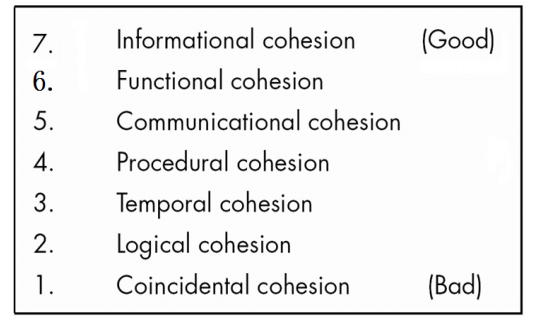
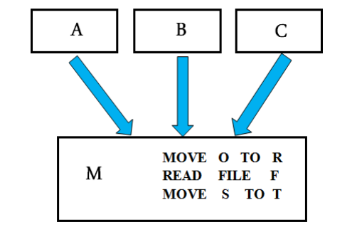
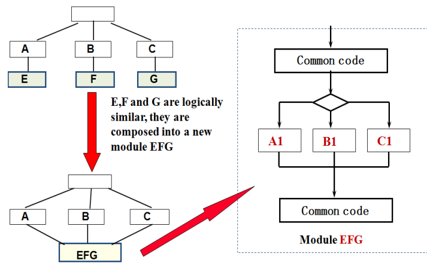
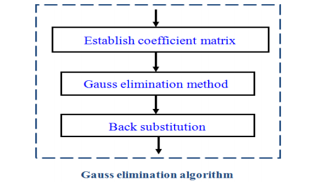
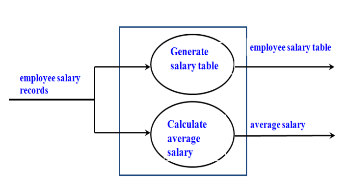
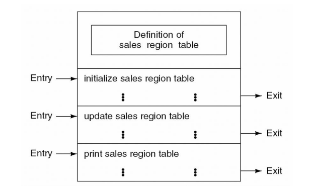

# 什么是模块？

语义上连续的一系列计算机语句，由边界符界定，有一个聚合标识符。

例如：在面向对象语言中，一个类，一个方法就是一个模块。在结构化的程序，一个函数可以称为一个模块

将产品分解成模块的方法

- 模块内最大交互，模块之间最小交互

模块的内聚

- 一个模块内的交互程度

模块的耦合

- 模块间的交互程度

## 内聚

一个模块内的交互程度

## 内聚的七种分类或等级

模块内部的交互程度越高越好，越低越差

1.偶然性内聚
2.逻辑性内聚
3.时间性内聚
4.过程性内聚
5.通信性内聚
6.功能性内聚
7.信息性内聚

### 1、偶然性内聚
如果一个模块执行了多个完全不相关的动作，那么它就具有偶然的内聚性

模块A，B，C都调用了模块M，模块M内部有 `MOVE O TO R`，`READ FILE F`，`MOVE S TO T`等语句，这些语句所做的事情毫无相干，所以可以说模块M具有偶然性内聚

偶然性内聚的缺点：

- 降低了可维护性
- 模块不可重用

解决方法：分成独立的模块，每个模块执行只一项任务。

### 2、逻辑性内聚

当一个模块执行一系列相关操作时，它具有逻辑内聚性，其中哪些操作被执行，由调用模块来决定。

模块A调用E，B调用F，C调用G，这时发现E，F和G模块的逻辑上很相似，如果将其合并一个EFG模块，这个EFG模块有共同的代码，也有不同的操作代码，EFG模块就具有了逻辑性内聚。

那么EFG模块就必须在内部添加逻辑判断，判断A、B和C中的哪个模块调用的，再执行相应的操作，EFG模块非常复杂，A，B和C显然要将这个模块的接口读懂，否则没有办法去调用。

逻辑性内聚的缺点：

接口难以理解
- 难以修改
- 多个操作的代码可能相互交织
- 增加耦合
- 低效率

### 3、时间性内聚
当一个模块执行一系列与时间相关的操作时，它就具有时间内聚性
模块中的操作必须同时执行。

例子：

- 初始化模块
- 错误处理模块
- 系统终止模块

例如：在错误处理模块和系统终止模块，我们需要去释放一些资源，或者是关闭一些正在打开的文件等等，这些操作本质上没有关联性，只不过这些操作需要在相同的时间段内被执行。所以这些模块被称之为时间性内聚。

时间性内聚的缺点：

- 该模块的内部操作之间的关联度较弱，但与其它模块的操作由较强的关联度。
- 不可重用

### 4、过程性内聚

模块执行一系列的操作，而这些操作在执行的顺序上是相关联的，这个模块具有过程性内聚。

例如：一个模块内部有图中这些操作，这些操作需要按设计好的先后顺序来执行。

过程性内聚存在的问题

- 操作之间的关联非常弱的，所以模块是不可重用的。

### 5、通信性内聚

一个模块具有通信性内聚，如果它执行一系列的操作，这些操作在执行的过程上相关联，而且这些操作在相同的输入或输出数据上操作。

例如：图中这个模块，它内部执行了两个操作，一个是生成工资报表，一个是生成平均工资，而这两个操作都是基于相同的输入数据，当然，这两个操作输出了不同的数据。

通信性内聚存在的问题：

- 仍然缺乏可重用性

### 6、功能性内聚

具有功能性内聚的模块只执行一个操作。

功能性内聚的优点：

- 更多重用性
- 更容易进行纠正性维护
    - 故障隔离
    - 较少的回归故障

- 该软件产品更容易进行扩展

### 7、信息性内聚

如果一个模块执行一些操作，每个操作都有自己的入口点，每个操作都有独立的代码，都在同一个数据结构上执行，那么这个模块就具有信息内聚性。

信息性内聚的优点：
本质上，这是一个抽象的数据类型

图中示例：在这个模块内部，有三个操作，一个是初始化销售记录，一个是修改销售记录，一个是打印销售记录，这三个功能都是基于相同的数据结构上操作的，这个数据结构就是数据记录。这三个操作，分别都有自己的出口点和入口点，和相对独立的代码。

----

参考或转载：
https://www.icourse163.org/course/NEU-1001812013

