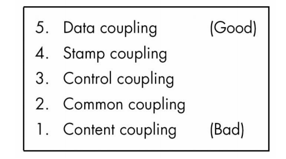
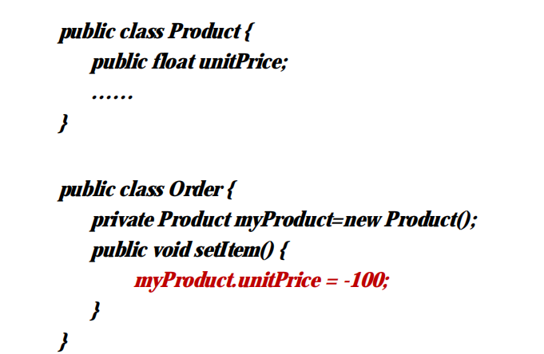
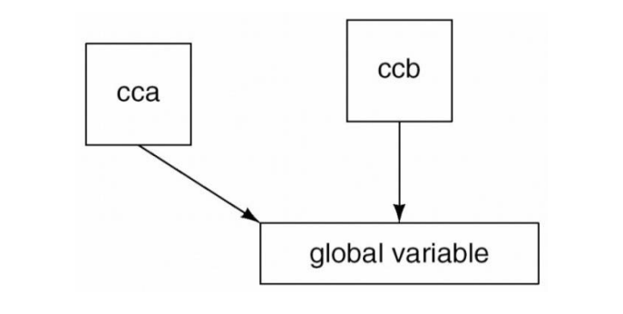
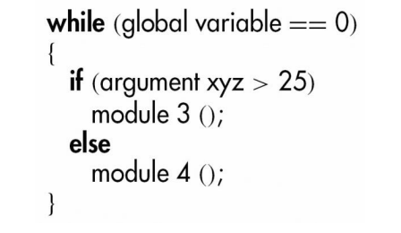
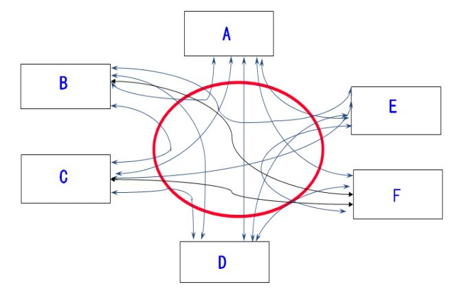
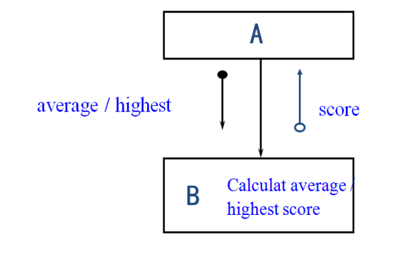
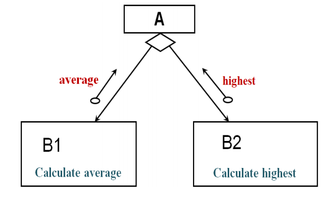
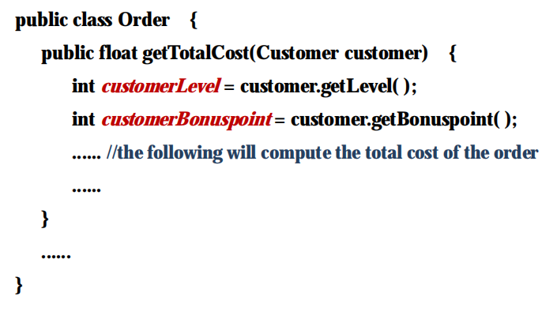

# 耦合

模块之间的交互程度

模块之间的耦合度越弱越好，越强越差

## 耦合的五种分类或等级

1.内容耦合
2.公共耦合
3.控制耦合
4.印记耦合
5.数据耦合

### 1、内容耦合
如果一个模块直接引用另一个模块的内容，那么两个模块就是内容耦合的。

内容耦合的缺点：

图中代码示例：在Order类的内部中，实例化Product类，直接通过myProduct实例访问该实例内部的字段，那么这两个类就构成了内容耦合。

内容耦合很危险，因为一个类内部的内容被另一个模块所控制，所以这是我们应该避免的。

### 2、公共耦合

如果两个模块对全局数据具有写入访问权限，则它们是公共耦合的。

公共耦合的缺点：

- 与结构化编程的精神相违背

- 由此产生的代码几乎是不可读的

对于公共耦合的态度，如果实在不能避免，那就尽量减少公共耦合。

### 3、控制耦合

如果一个模块向另一个模块传递控制元素，那么两个模块就是控制耦合。

例子：

作为参数传递的控制开关

控制耦合的缺点：

- 模块不是独立的；模块b（被调用模块）必须知道模块a（调用模块）的内部结构和逻辑。

- 影响可重用性

- 控制耦合导致被调用模块的逻辑性内聚

示例：模块A调用模块B，模块B具有逻辑性内聚，它做两件事情，一个是就算平均值，一个是取最高值，模块B做哪一件事情决定于模块A传递给模块B的参数，如果模块A传递的参数的average，那么模块B就知道它应该做的事情的计算平均值，如果模块A传递的是highest，那么模块B就去做取最高值，然后把结果返回给模块A。

解决的办法是：

把逻辑判断从被调用模块B中提升到调用模块A中，然后把模块B拆分成两个模块，使每一个模块执行单一的功能。

模块B被分为B1和B2，分别取做平均值和最高值。

### 4、印记耦合

有些语言只允许传递简单的变量作为参数

例如：

- 数量

- 学生姓名

- 单价

许多语言还支持数据结构的传递

例如：

- Record

- ResultSet

- HashMap

如果一个数据结构被作为参数来传递，而且被调用模块只对传递的数据中的一部分进行了操作，那这两个模块互相之间就是印记耦合。

印记耦合的缺点：

示例：在类Order中，方法getTotalCost，所传递的参数是Customer类的实例customer，在这个方法内部再去取这个实例的等级，然后再获取customer的折扣点。

事实上，在该方法的内部，真正需要的变量只是customerLevel和customerBonuspoint，很显然，传过来的customer中的很多其他属性和数据都不需要，所以该模块和其并用模块之间就具有了印记耦合。

- 如果不通读整个模块，就不清楚记录的哪些字段被访问或更改。

- 难以理解

- 不太可能重复使用

### 5、数据耦合

两个模块之间数据耦合，如果所有参数都是同类的数据参数，也就是说，每一个参数，或者是简单的数据结构，或者是简单的数据类型，或者数据结构内部的所有数据都被调用模块所使用。

例如：

- display time of arrival ( FlightNo )
- 根据航班号，显示航班抵达的时间
- computeTotalPrice( UnitPrice, Qty );
- 根据单价和数量，计算总价
- get job with highest priority ( JobQueue )
- 从一个队列中，找出优先级最高的任务

数据耦合的好处在哪里？

- 内容、公共、控制和印记耦合中存在的问题，数据耦合没有存在这些问题。

- 易于维护

----

参考或转载：
https://www.icourse163.org/course/NEU-1001812013

