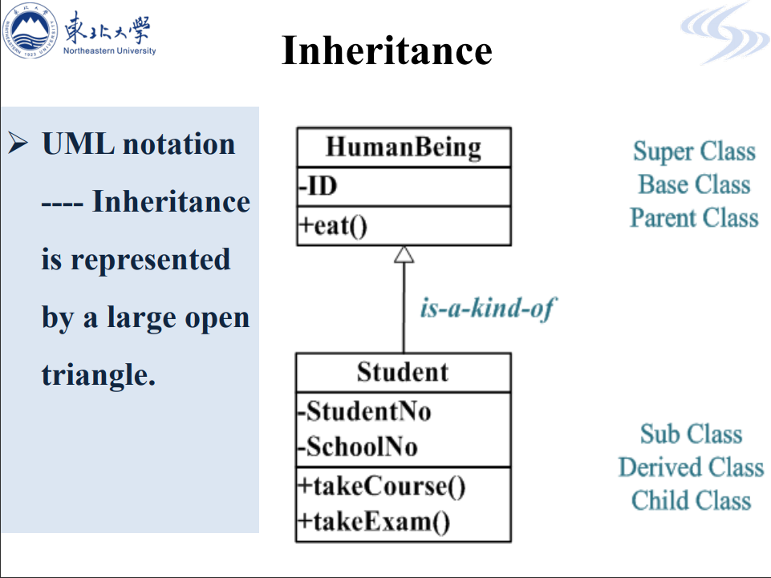

类与对象

类：支持继承的抽象数据类型

对象：对象所派生出来的实例

例如：

人就可以被定义为一个类

人有很多属性，如：身份证号，名字等等。

学生也可以定义为一个类，而且学生也是一种人，学生可以称为人的子类

学生可以继承人的属性以及方法

学生还可以具有自己的属性，如：所在学校名称，学生号等等

用UML类图来表示人和学生之间的继承关系

 用空心三角来指向父类“人”，在人这个类的内部，有属性ID和方法eat等等，

没必要做，这里讲的不够深入，没有难点