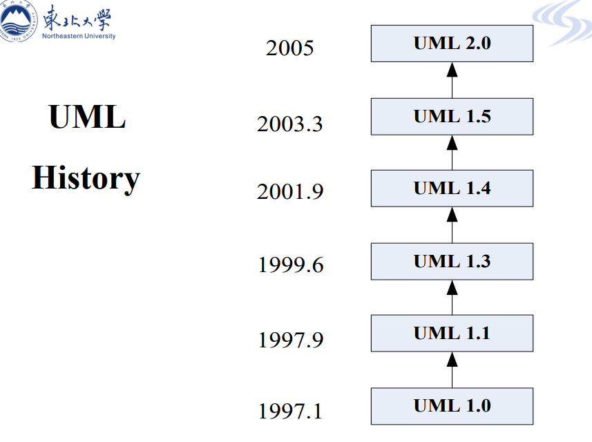
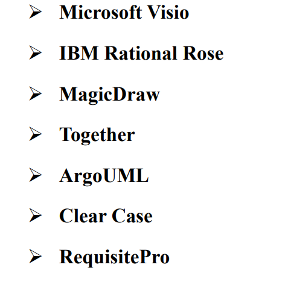

# UML的简介

UML——Unified Modeling Language（统一建模语言）

统一建模语言是为软件架构时，设计时，为程序员提供一种图形化建模语言的工具。

# UML的历史

# UML图

UML定义了各种图，如：

- use case diagram 用例图

- activity diagram 活动图

- state diagram 状态图

- class diagram(preliminary) 简单类图

- class diagram(complex) 复杂类图

- sequence diagram 顺序图

- collaboration diagram 协作图 

通常，在完成了需求调研和需求文档之后，开发方要做用例建模，绘制用例图，基于用例图，要完成简单类图，也就是说只包括实体类的类图，对于简单类图，可能还需要状态图进行补充，如果需要，基于用例图，还会画出活动图来深入和详细的描述业务处理过程，基于用例图和简单类图，还会可能画出顺序图来说明每个用例的具体实现过程，如果需要还会可能画协作图。

到了设计阶段，还会基于前面的简单类图，设计出包括实体类、界面类和边界类的详细类图。

# UML工具

