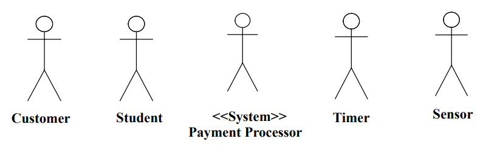
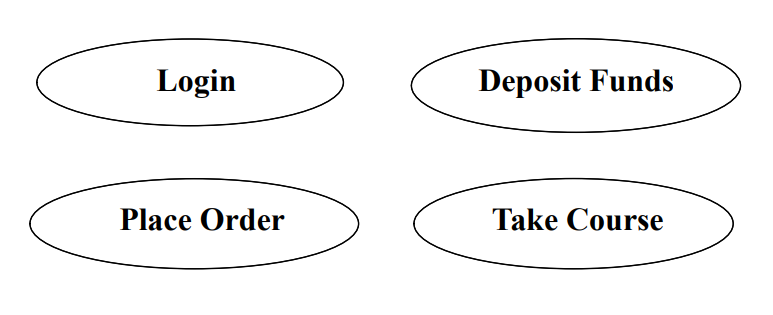
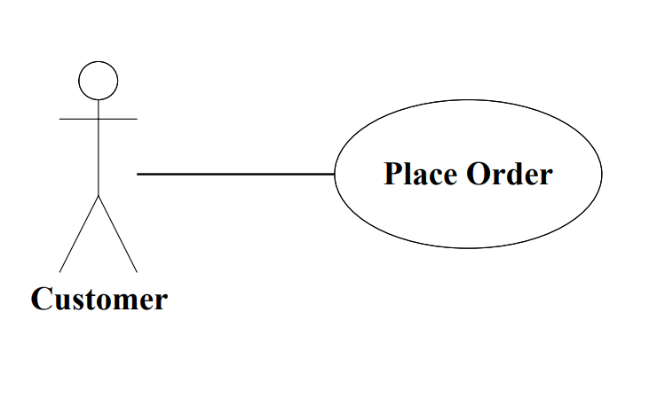

# 统一过程

统一过程是现在最好的面向对象范型

分析工作流是为了更深的理解需求，使设计和实现目标软件系统更容易。

统一过程覆盖了三种类，包括

- 实体类

- 边界类

- 控制类

分析工作流涉及的是实体类

## 面向对象分析的三项工作

### 1.用例建模

用来确认目标系统如何来提供一些功能（不考虑这些功能的先后顺序），所获得结果是用例图。

### 2.类建模

用来确定这些实体类和实体类的属性，所获得结果是类图。

### 3.动态建模

用来确定由一个实体类或者是对一个实体类所作的操作，所获得结果是状态图。

什么是用例模型

一个根据用例描述系统功能需求的模型

用例模型包括三个元素

- 系统环境——参与者
- 系统预期功能——用例
- 参与者和用例之间的关系

#### 参与者是什么？

参与者是指用户与目标系统的用例交互式所进行扮演的角色

- 参与者不是目标软件系统的一部分 ——在目标软件系统外部
- 参与者可以是一个人，可以是一个机器，或者是外部存在的一个软件系统
- 参与者可以是信息的主动给予者，也可以是信息的被动接收者

#### 参与者符号

在用例图中，参与者用一个小人来代表，这个小人要用单数的，与领域相关的名词来命名，这个名词应该能够正确地反映出用户与模型进行交互式所扮演的角色
例如：
- 在电子商务系统中的顾客
- 在学生管理系统中的学生
- 也有可能是另一个已存在的收费管理系统
- 计时器
- 感应器

#### 参与者有什么用？

参与者能够帮助我们界定目标软件系统的范围，是我们对于软件系统要做什么有一个清晰的轮廓

用例将基于参与者的需求来开发，以确保最后所开发的系统是用户所期望的。

用例描述了一系列的行为，这些行为由系统来完成，并且对某一个特定的客户返回可观察到的结果。

一个用例描述一个系统做什么，但是却不描述它是怎么做的。

例如：
- 修课程
- 考试
- 存款
- 下订单
- 订机票
- 借书

## 用例模型中的用例符号

在用例图中，用例用一个椭圆形来表示，并且在椭圆形中标识用例名，用例名应该是与领域相关的，并且用强动词来开头的。

例如：登录，存款，下订单，修课程

### 参与者和用例之间的关系

- 一个用例应该是由参与者发起，来激活软件系统中的某一个功能

- 一个用例模拟了一个或多个参与者与系统之间的对话

### 用例模型中的关系符号

- 一个参与者可以连接到一个或多个用例，这个连接称之为关联，在用例图中，关联用一个连接了参与和用例之间的一条直线来表示。

- 一个参与者和一个用例之间的关联，说明了这个参与者和这个用例之间彼此通信，每一个都能发送和接受消息

例如：

在电子商务系统中

顾客和下订单存在关联关系

