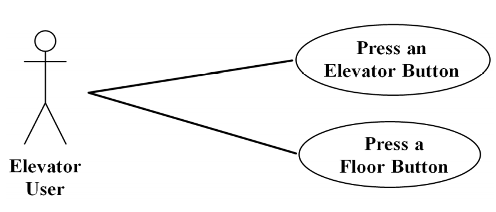
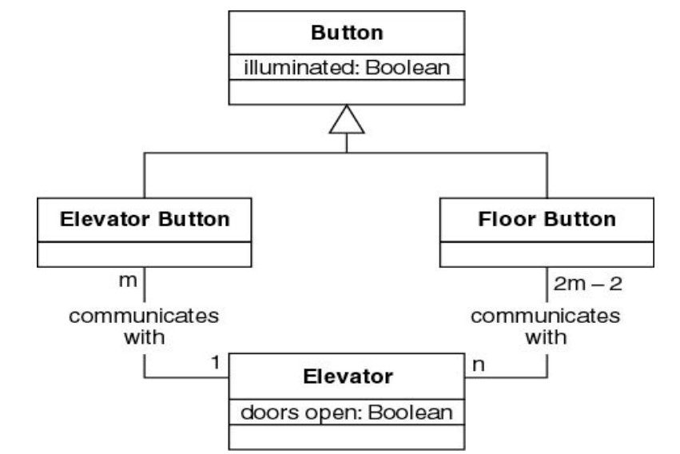
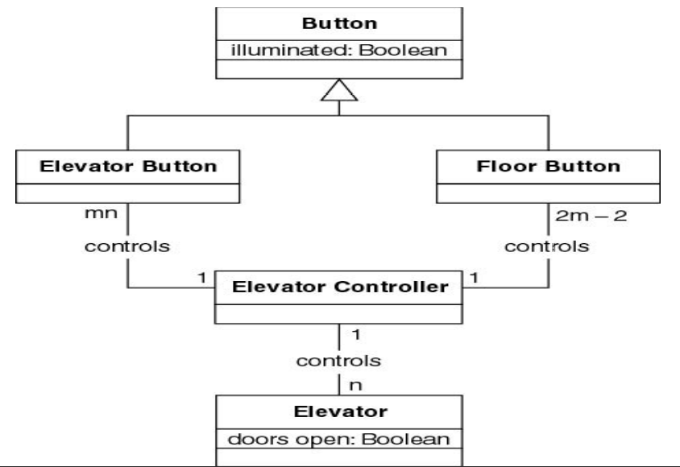
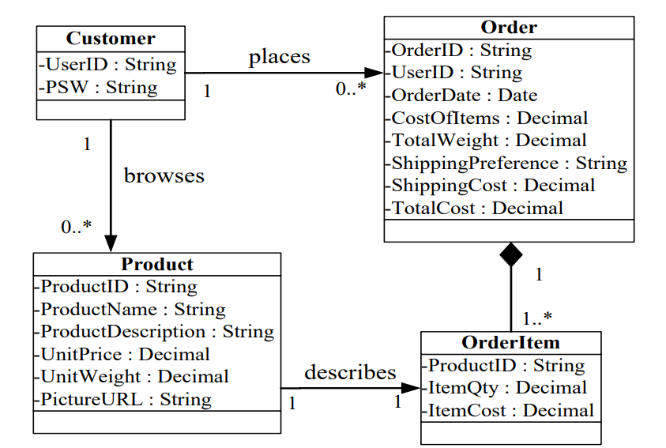

类建模获得的结果是类图

# 什么是类图

- 类图表达的是在软件系统中的实体类和它们之间的关系。

- 类图表达了模型的静态结构，包括类以及类的内部结构和类之间的关系。

- 分析阶段的类图主要是针对功能性需求的一种静态视图。

# 类建模的两种方式

- 名词抽取方法
- CRC卡片方法，Class-Responsibility-Collaboration（类-职责-协作）
    - 需要较多的领域知识
    - 适合对类图进行测试

## 名词抽取方法

### 1.对软件系统的业务进行言简意赅的描述

例如，以电梯为例子

电梯中的按钮和楼层中的按钮，控制了有m层的建筑的n部电梯的移动，但按钮被按下，请求在某一个特定的楼层停留，按钮将亮，当该请求被满足时，按钮将熄灭，当一部电梯没有请求时，它将停留在当前的楼层，电梯门是关闭的。

### 2.从描述中抽取名词作为实体类

这些名词可能会成为候选类

#### 名词抽取

从上面的描述中，抽取出了这几个名词：按钮（button），电梯（elevator），楼层（floor），移动（移动），建筑（building），灯亮（illumination），门（door）。

进一步分析，移动，灯亮都是抽象名词，它们不可能成为实体类，但是很有可能会成为其他实体类的属性。

楼层，建筑，门不在电梯范围之内，所以也被排除了。

剩下两个候选类，电梯和按钮

在用例图中，抽取出两个名词，电梯按钮和楼层按钮。加在一起获得了四个候选类：电梯、按钮、电梯按钮和楼层按钮。

这样子就获得了第一个版本的类图。

按钮类有一个属性illuminated，它是布尔值，它有两个子类，电梯按钮和楼层按钮，还有一个类：电梯。

一部电梯中有m个电梯按钮，n部电梯在楼层中有2m-2个楼层按钮

经过分析，我们发现电梯并不会直接与按钮进行通信，所以还需要一个类：电梯控制类（Elevator Controller）。

按钮和电梯都是和电梯控制器进行通信，也就是说，电梯控制器将控制mn个电梯按钮和2m-2个楼层按钮。

### 案例二

对网上商店进行分析，会得到以下这个类图

Customer顾客，Order订单，Product产品，OrderItem订单的子项

顾客是参与者，但是顾客需要注册，所以顾客有用户名属性和密码属性，顾客是个实体类，顾客需要下订单，所以订单也是一个重要的实体类，订单类有订单号、用户名、订单日期、总价、货物总重量、运输方式、运输费用、总花费等等属性。

顾客和订单是places关系，一个顾客可以下 零到多个订单，一个订单还要包括一到多个订单子项，订单子项有产品号、产品属性和产品花费等属性。

顾客和产品是浏览的关系，产品类有 产品号、产品名、产品描述、单价、单个重量和图片介绍地址等属性。

