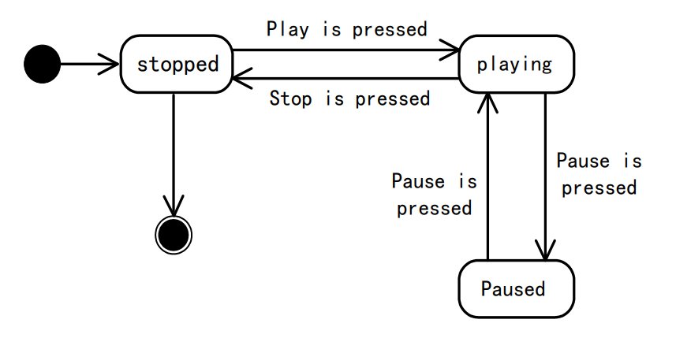
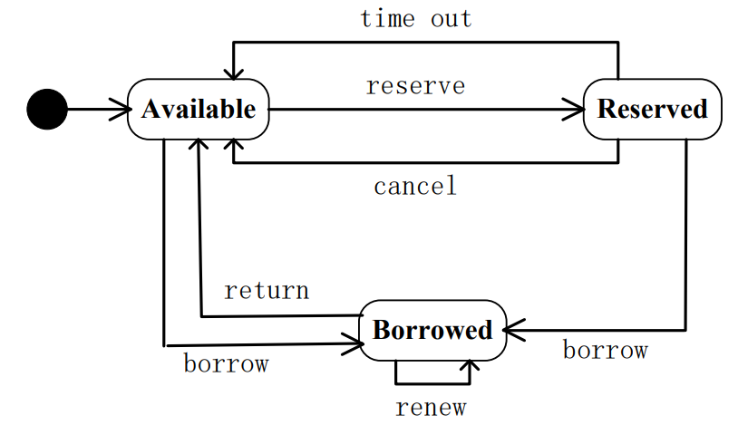
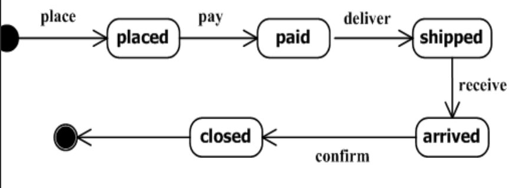
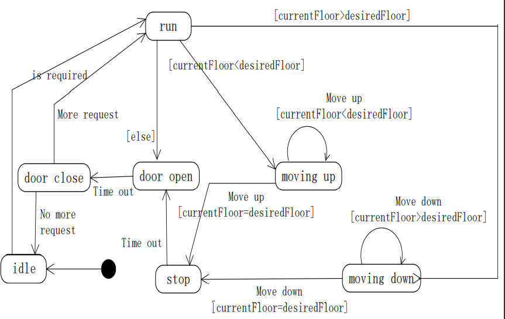

动态建模的产品是状态图

状态图是对类的补充，它描述了一个类的实例可能的各种状态以及造成状态改变的事件。

一个事件可能是造成状态改变的行为，也有可能是从另一个类传来的消息或者满足一些条件

不是所有类都需要状态图，有些类在事件下或条件下会发生某些状态的明确改变，这样子的类才需要做状态图

# 案例一

用状态图来表示一个CD播放器的状态改变，CD播放器可能的状态包括停止，播放，暂停，可能包括的事件有：中止按钮被按下，停止按钮被按下和播放按钮被按下。

状态图如下：

纯黑点是开始，有白色内层的黑点是结束。

# 案例二

 在图书馆管理系统中，一本书的状态包括：可借、被借出和被预订，可能包括事件有：借、还、预约、取消预约、超出预约时间和续借。

# 案例三：

在商店系统中的订单，一个订单的状态或经历过 已下订单、已付款、已发货、已收货和结束。

# 案例四：

电梯系统

