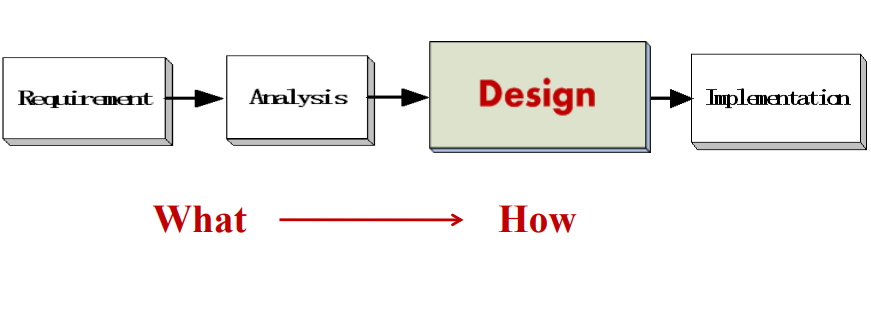
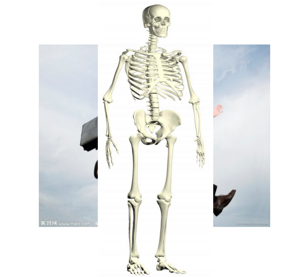
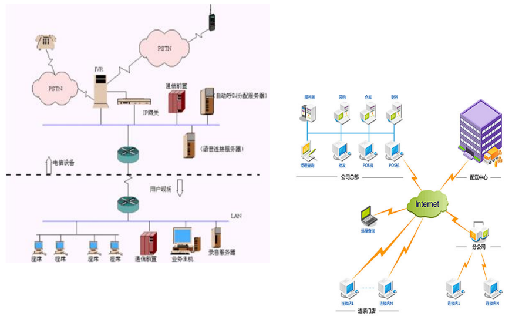
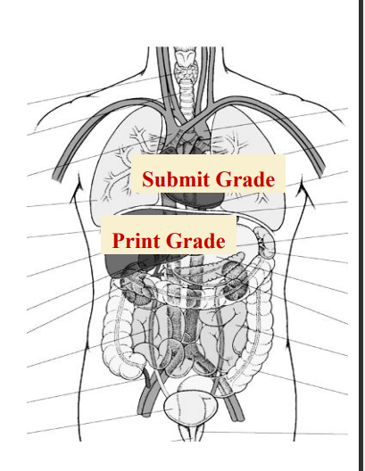
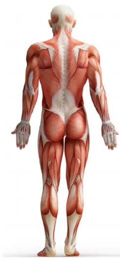
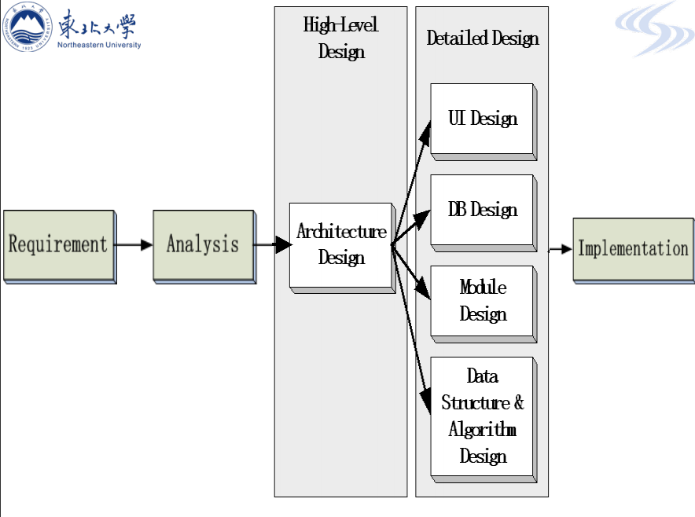

# 架构设计

例子：设计一个人

人体骨骼就是软件架构，软件架构描述了软件的整体结构，以及在概念上整合到一起的方法。

软件架构例子

# 模块设计

## 模块——器官

- 功能独立
- 可集成的

## 模块化规则

- 信息隐藏
- 高内聚
- 低耦合

## 数据库设计

数据可——大脑

- 储存数据
- 处理数据

数据库系统——数据库提供商提供数据库服务

- 大型数据库：Oracle，DB2，Informix，Sybase
- 中型数据库：SQL Server
- 小型数据库：mySQL（免费），PostGre（免费），access

## 数据结构和架构设计

数据结构和架构就是——神经和肌肉

将所有组件连接在一起，使它们作为一个整体系统工作

## 用户界面设计

- 用户界面——外表
- 要求
    - 易用
    - 美观大气 

