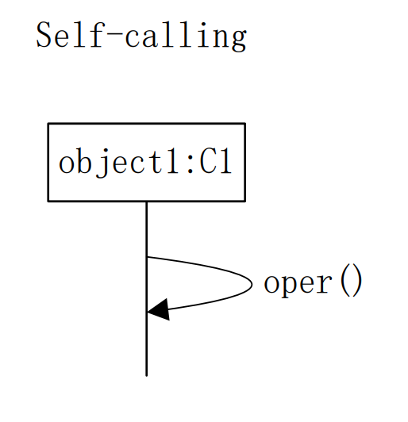
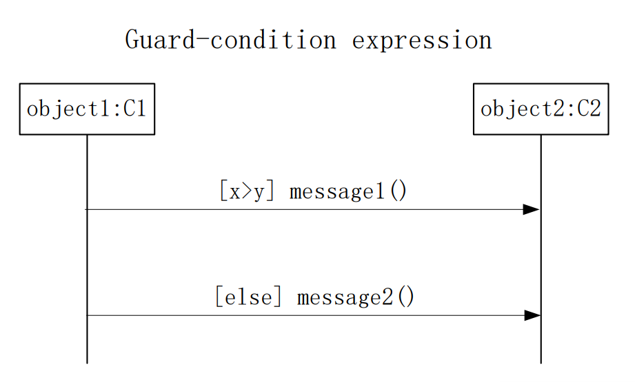
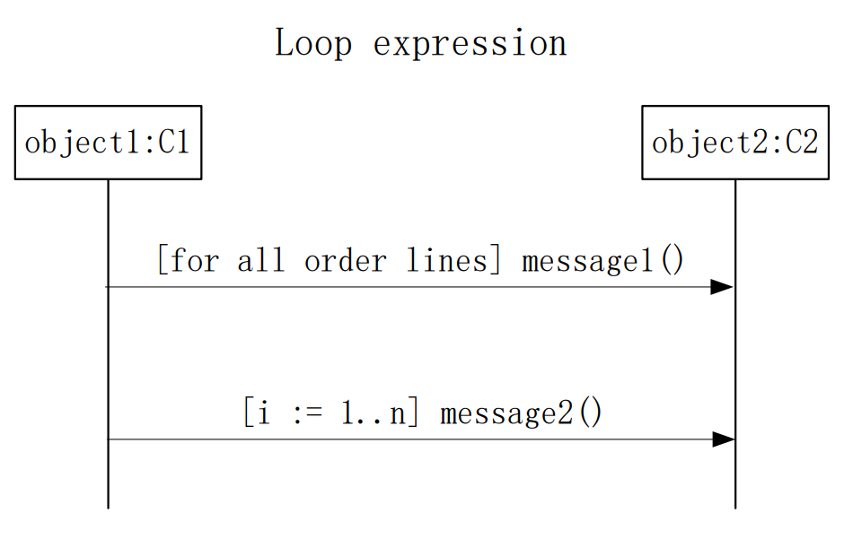
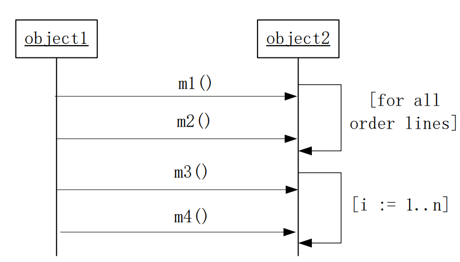
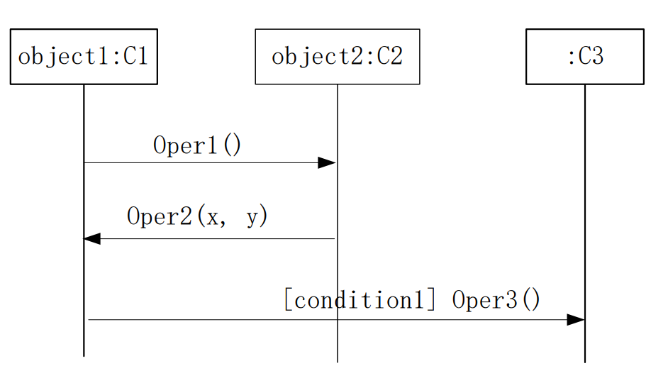
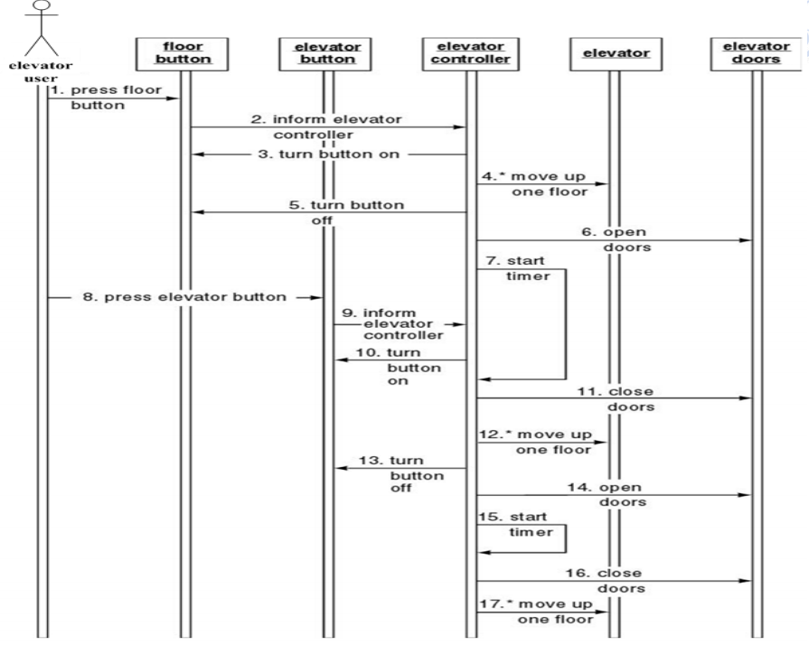
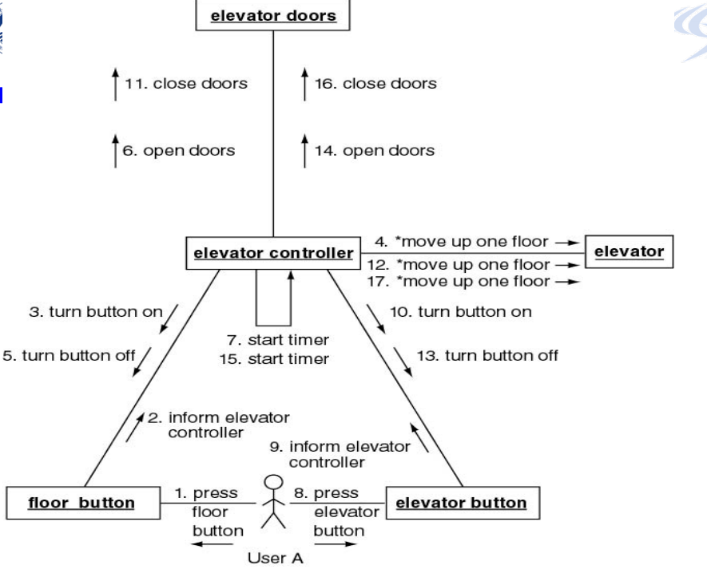
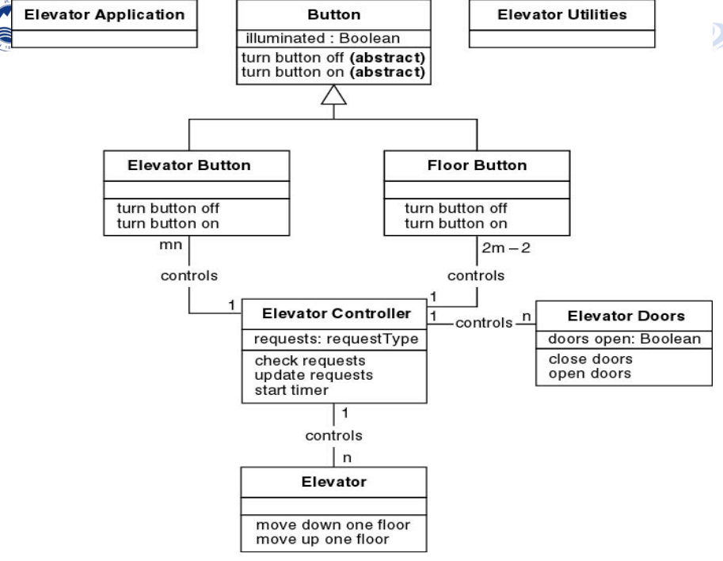
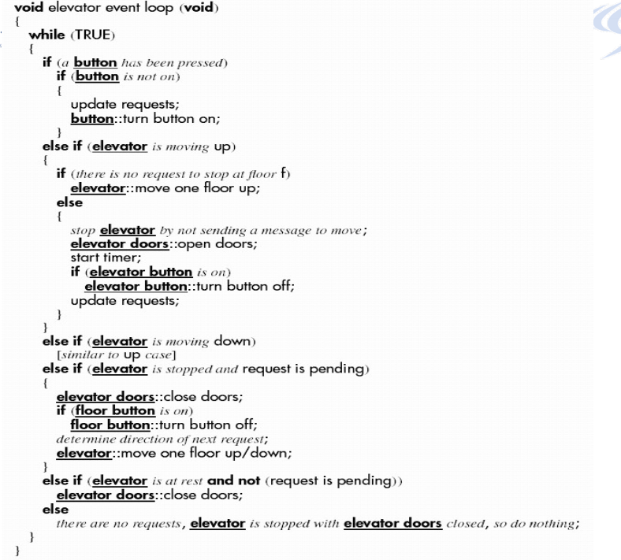

# 面向对象设计包括三项工作

## 1、构建交互图

设计者为分析阶段定义的每个用例场景创建一个序列图或一个协作图。

## 2、完成类图

在初步类图的基础上，设计人员完成了一个包含各种类及其属性和方法的详细类图。

详细类图包括

- 实体类
- 边界类
- 控制类

## 3、进行详细设计

然后，设计人员为每个方法指定要实现的算法，以及每个方法所需的内部变量和数据结构

### 交互图

以电梯问题为例子来进行面向对象设计

首先要给每一个情景构造交互图

- 顺序图
- 协作图

顺序图和协作图比较

- 他们所反映的事情是相同的
- 交互图中包括对象和它们之间传递的信息
- 但以不同的方式

#### 顺序图

 每一个对象应该是每一个类所派生出来的一个实例，object1对象是C1类的实例，该对象下面的直线代表该对象的生命线，带箭头的弧线从生命线又指向生命线，指的是该对象调用了自身的方法，称之为自我调用

顺序图中条件的表达方法

图中有两个对象，根据判断传输消息即可。

循环发送消息

电梯例子

1.用户A在三楼按下了向上的按钮来请求一个电梯，用户A想要去七楼。

2.楼层按钮通知电梯控制器，楼层按钮被按下了。

3.电梯控制器向向上按钮发送一条消息，告诉它点亮自己。

4.电梯控制器向电梯发送一系列信息，使其自行上升到楼层。

流程控制图

#### 协作图

构造一个详细的类图

如何给一个类分配方法

- 信息隐藏
- 把一个方法分配给一个被激活的对象或者类
- 职责-驱动-设计

例如：

- 关门分配给电梯门
- 电梯移动方法分配给电梯

电梯系统的详细类图

### 详细设计

使用程序描述语言进行详细设计

例如：对于电梯方法电梯控制器循环的详细设计如下：

## 设计阶段的测试

基本原则

- 设计能够正确体现目标系统的规格说明

- 设计本身必须正确

